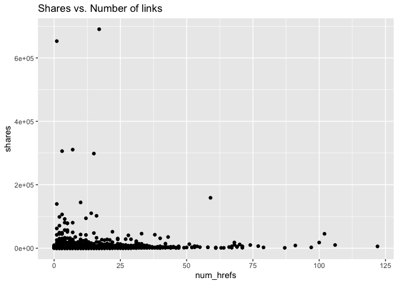
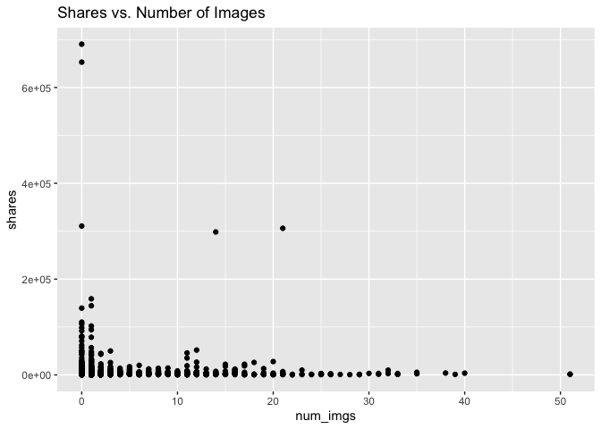
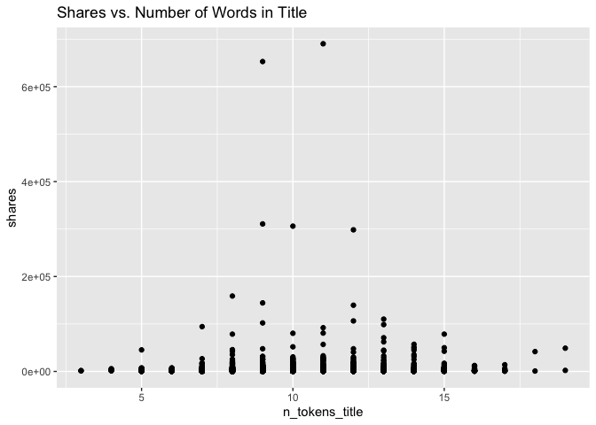
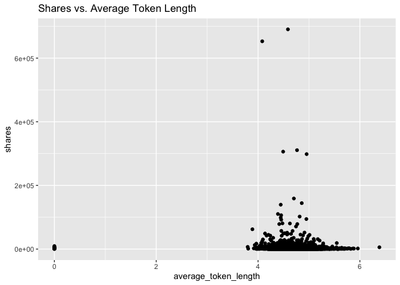

Project 3
================
Nicole Levin
11/14/22

# Analysis of bus channel

## Introduction

This report analyzes one data channel of a dataset of features about
articles published by Mashable over a two year period. This report
contains some summary statistics and plots, model-fitting for a linear
regression model and a boosted tree, and a comparison of the predictive
abilities of the two models. There are six data channels in the complete
dataset: lifestyle, entertainment, business, social media, technology,
and world. Results for the other channels can be seen in their
respective reports. The full dataset contains 61 attributes for each
article, but we will focus our attention on the following six predictor
variables for summarizing and modeling.

1.  num_hrefs: Number of links
2.  n_tokens_title: Number of words in the title
3.  kw_avg_avg: Average keyword
4.  average_token_length: Average length of the words in the content
5.  num_imgs: Number of images
6.  n_non_stop_unique_tokens: Rate of unique non-stop words in the
    content

The packages required for creating this report are the following:

1.  `tidyverse`
2.  `caret`
3.  `leaps`
4.  `rmarkdown`
5.  `knitr`

We will start with loading the required packages and reading in the
data.

``` r
#Load packages
library(tidyverse)
library(caret)
library(leaps)
library(rmarkdown)
library(knitr)

#Use a relative path to import data. 
news_data <- read_csv("OnlineNewsPopularity.csv")
```

    ## Rows: 39644 Columns: 61
    ## ── Column specification ───────────────────────────────────────────────────────────────────────────
    ## Delimiter: ","
    ## chr  (1): url
    ## dbl (60): timedelta, n_tokens_title, n_tokens_content, n_unique_tokens, n_non_stop_words, n_non...
    ## 
    ## ℹ Use `spec()` to retrieve the full column specification for this data.
    ## ℹ Specify the column types or set `show_col_types = FALSE` to quiet this message.

``` r
#Filter data for just the desired channel.
channel_filter <- paste0("data_channel_is_", params[[1]])
selected_data <- filter(news_data, get(channel_filter) == 1)
selected_data <- selected_data %>% select(num_hrefs, n_tokens_title, kw_avg_avg, average_token_length, num_imgs, n_non_stop_unique_tokens, shares)
```

## Summary Statistics

Before modeling, we’ll look at some basic summary statistics and graphs,
starting with a summary table of means and standard deviations of all of
our variables of interest. These will give us an idea of the center and
spread of the distributions of each of our variables.

``` r
#Calculate means and standard deviations
col_means <- colMeans(selected_data)
col_sds <- apply(selected_data,2,sd)

#Put into a table
data_table <- rbind(t(col_means), t(col_sds))
row.names(data_table) <- c("Mean", "Std. Dev.")
kable(data_table)
```

|           | num_hrefs | n_tokens_title | kw_avg_avg | average_token_length | num_imgs | n_non_stop_unique_tokens |    shares |
|:----------|----------:|---------------:|-----------:|---------------------:|---------:|-------------------------:|----------:|
| Mean      |  9.356184 |      10.282039 |   2951.790 |            4.6880223 | 1.808405 |                0.7030530 |  3063.019 |
| Std. Dev. |  8.433127 |       2.160168 |   1452.468 |            0.3904164 | 3.494494 |                0.0951001 | 15046.388 |

Next, we will look at a scatterplot of number of links vs. shares. An
upward trend in this graph would indicate that articles with additional
links tend to be shared more often. A downward trend would indicate that
articles with additional links tend to be shared less often.

``` r
#Create a scatterplot for num_hrefs vs shares
g <- ggplot(data=selected_data, aes(x=num_hrefs, y=shares))
g + geom_point() + labs(title = "Shares vs. Number of links")
```

<!-- -->

Next, we will look at a scatterplot of number of images vs. shares. An
upward trend in this graph would indicate that articles with more images
tend to be shared more often. A downward trend would indicate that
articles with additional images tend to be shared less often.

``` r
#Plot num_imgs vs shares
g <- ggplot(data=selected_data, aes(x=num_imgs, y=shares))
g + geom_point() + labs(title = "Shares vs. Number of Images")
```

<!-- -->

Next, we will look at a scatterplot of number of words in the title
vs. shares. An upward trend in this graph would indicate that articles
with additional words in the title tend to be shared more often. A
downward trend would indicate that articles with additional words in the
title tend to be shared less often.

``` r
#Plot words in title vs. shares
g <- ggplot(data=selected_data, aes(x=n_tokens_title, y=shares))
g + geom_point() + labs(title = "Shares vs. Number of Words in Title")
```

<!-- -->

Next, we will look at a scatterplot of average word length vs. shares.
An upward trend in this graph would indicate that articles with a larger
average word length tend to be shared more often. A downward trend would
indicate that articles with a larger average word length tend to be
shared less often.

``` r
#Plot average word length vs. shares
g <- ggplot(data=selected_data, aes(x=average_token_length, y=shares))
g + geom_point() + labs(title = "Shares vs. Average Token Length")
```

<!-- -->

## Model Preparation

Next, we will prepare for modeling by splitting the data into a training
and test set. We will use the training set to fit two models, a linear
regression and a boosted tree. The test set will be then used to
evaluate the abilities of the models to predict out of sample results
for number of shares.

``` r
#Split data for modeling into train and test sets.
set.seed(371)
train_index <- createDataPartition(selected_data$shares, p=0.7, list=FALSE)
data_train <- selected_data[train_index, ]
data_test <- selected_data[-train_index, ]
```

## Linear Regression Model

The first model we will look at is a basic linear regression model. In
linear regression, the best-fit model is found by minimizing the sum of
the squares of the residuals. The parameter estimates are then used in
the regression equation for prediction of future values, finding
confidence intervals for mean values, etc. Linear regression is often
the simplest option and can be more interpretable than some of the
ensemble methods, but it often loses out when prediction is the most
important goal.

``` r
#Create a linear regression. 
linear_reg <- lm(shares ~ num_hrefs + n_tokens_title + num_imgs + average_token_length + kw_avg_avg + n_non_stop_unique_tokens, data = data_train)
summary(linear_reg)
```

    ## 
    ## Call:
    ## lm(formula = shares ~ num_hrefs + n_tokens_title + num_imgs + 
    ##     average_token_length + kw_avg_avg + n_non_stop_unique_tokens, 
    ##     data = data_train)
    ## 
    ## Residuals:
    ##    Min     1Q Median     3Q    Max 
    ## -22239  -1816  -1023    -28 647271 
    ## 
    ## Coefficients:
    ##                            Estimate Std. Error t value Pr(>|t|)    
    ## (Intercept)               3785.3447  2432.9785   1.556  0.11982    
    ## num_hrefs                  113.4278    24.5791   4.615 4.05e-06 ***
    ## n_tokens_title              -6.5470    80.4436  -0.081  0.93514    
    ## num_imgs                    -3.1566    51.5910  -0.061  0.95121    
    ## average_token_length     -1936.9613   496.0566  -3.905 9.58e-05 ***
    ## kw_avg_avg                   0.6023     0.1095   5.500 4.01e-08 ***
    ## n_non_stop_unique_tokens  7655.7883  2191.0304   3.494  0.00048 ***
    ## ---
    ## Signif. codes:  0 '***' 0.001 '**' 0.01 '*' 0.05 '.' 0.1 ' ' 1
    ## 
    ## Residual standard error: 11450 on 4375 degrees of freedom
    ## Multiple R-squared:  0.01524,    Adjusted R-squared:  0.01389 
    ## F-statistic: 11.29 on 6 and 4375 DF,  p-value: 1.511e-12

## Boosted Tree Model

Tree-based methods are another modeling option available. The
methodology for trees is to split the predictor space into regions with
different predictions for each region. Boosting trees is a way to
improve the predictive ability over a single tree fit. Boosting is slow
fitting of trees where trees are grown sequentially. Each tree grown on
a modified version of the original data and the predictions update as
the trees grow. Boosting typically improves the predictive performance
over a single tree fit.

``` r
#Create a boosted tree fit. 
tuneGrid = expand.grid(n.trees = c(25, 50, 100, 150, 200), interaction.depth = 1:4, shrinkage = c(0.05, 0.1, 0.2), n.minobsinnode = 10)
boosted_tree <- train(shares ~ ., data = data_train, method = "gbm", 
                      preProcess = c("center", "scale"),
                      trControl = trainControl(method = "cv", number = 10), 
                      tuneGrid = tuneGrid, verbose = FALSE)
boosted_tree
```

    ## Stochastic Gradient Boosting 
    ## 
    ## 4382 samples
    ##    6 predictor
    ## 
    ## Pre-processing: centered (6), scaled (6) 
    ## Resampling: Cross-Validated (10 fold) 
    ## Summary of sample sizes: 3943, 3943, 3944, 3944, 3944, 3944, ... 
    ## Resampling results across tuning parameters:
    ## 
    ##   shrinkage  interaction.depth  n.trees  RMSE       Rsquared    MAE     
    ##   0.05       1                   25       8686.427  0.01742243  2396.863
    ##   0.05       1                   50       8736.772  0.01595815  2405.440
    ##   0.05       1                  100       8802.949  0.01579763  2416.350
    ##   0.05       1                  150       8812.717  0.01551161  2421.783
    ##   0.05       1                  200       8843.467  0.01546417  2433.343
    ##   0.05       2                   25       8657.673  0.02173309  2361.631
    ##   0.05       2                   50       8736.403  0.01921986  2365.308
    ##   0.05       2                  100       8905.693  0.02032849  2417.970
    ##   0.05       2                  150       9015.936  0.01845790  2454.209
    ##   0.05       2                  200       9067.891  0.01828358  2459.794
    ##   0.05       3                   25       8598.088  0.02589241  2333.967
    ##   0.05       3                   50       8680.573  0.02667684  2348.817
    ##   0.05       3                  100       8770.040  0.02385704  2375.354
    ##   0.05       3                  150       8903.018  0.02297731  2425.063
    ##   0.05       3                  200       8941.555  0.02457178  2433.486
    ##   0.05       4                   25       8639.889  0.02354425  2345.913
    ##   0.05       4                   50       8721.635  0.02485425  2380.681
    ##   0.05       4                  100       8815.371  0.02735240  2416.373
    ##   0.05       4                  150       8851.301  0.02725264  2422.809
    ##   0.05       4                  200       8935.189  0.02757698  2447.405
    ##   0.10       1                   25       8729.460  0.01335417  2395.065
    ##   0.10       1                   50       8826.014  0.01565632  2433.776
    ##   0.10       1                  100       8880.217  0.01613296  2450.452
    ##   0.10       1                  150       8919.643  0.01707867  2435.877
    ##   0.10       1                  200       8996.087  0.01806995  2444.479
    ##   0.10       2                   25       8799.117  0.01897726  2393.799
    ##   0.10       2                   50       8854.406  0.02360881  2418.825
    ##   0.10       2                  100       8977.773  0.02404838  2440.362
    ##   0.10       2                  150       9285.663  0.01739843  2500.084
    ##   0.10       2                  200       9677.232  0.01320270  2572.819
    ##   0.10       3                   25       8839.436  0.01843050  2397.502
    ##   0.10       3                   50       8854.564  0.02685853  2418.160
    ##   0.10       3                  100       9031.821  0.02455391  2463.994
    ##   0.10       3                  150       9107.665  0.02578300  2492.359
    ##   0.10       3                  200       9278.759  0.02494988  2515.027
    ##   0.10       4                   25       8848.425  0.02116733  2423.377
    ##   0.10       4                   50       8907.173  0.02012840  2428.149
    ##   0.10       4                  100       8995.047  0.02277078  2427.693
    ##   0.10       4                  150       9213.401  0.02244482  2501.108
    ##   0.10       4                  200       9384.491  0.01937053  2518.400
    ##   0.20       1                   25       8813.677  0.01870098  2417.810
    ##   0.20       1                   50       8909.330  0.01524186  2453.133
    ##   0.20       1                  100       8960.804  0.01670342  2433.762
    ##   0.20       1                  150       9203.534  0.01556349  2424.467
    ##   0.20       1                  200       9463.222  0.01527051  2457.346
    ##   0.20       2                   25       8998.326  0.01607623  2448.529
    ##   0.20       2                   50       9308.753  0.01463575  2496.282
    ##   0.20       2                  100       9913.883  0.01049206  2617.847
    ##   0.20       2                  150      10454.955  0.01116713  2676.656
    ##   0.20       2                  200      10726.520  0.01067607  2708.195
    ##   0.20       3                   25       8900.932  0.01950859  2417.364
    ##   0.20       3                   50       9033.794  0.02155321  2459.921
    ##   0.20       3                  100       9338.471  0.01914974  2520.142
    ##   0.20       3                  150       9643.969  0.01919005  2583.193
    ##   0.20       3                  200      10069.807  0.01643715  2648.548
    ##   0.20       4                   25       8924.426  0.01946032  2438.515
    ##   0.20       4                   50       9070.866  0.01794459  2446.837
    ##   0.20       4                  100       9422.366  0.01463113  2499.641
    ##   0.20       4                  150       9999.181  0.01479694  2632.517
    ##   0.20       4                  200      10158.208  0.01774630  2660.610
    ## 
    ## Tuning parameter 'n.minobsinnode' was held constant at a value of 10
    ## RMSE was used to select the optimal model using the smallest value.
    ## The final values used for the model were n.trees = 25, interaction.depth = 3, shrinkage = 0.05
    ##  and n.minobsinnode = 10.

## Model Comparison

Now the two models will be compared based on their ability to predict
out of sample results for number of shares. The model with the lower
RMSE will be selected as the better model.

``` r
#Make predictions using the test data
pred_reg <- predict(linear_reg, newdata = data_test)
pred_boost <- predict(boosted_tree, newdata = data_test)
results_reg <- postResample(pred_reg, obs = data_test$shares)
results_boost <- postResample(pred_boost, obs = data_test$shares)

#Create table of results
results_table <- rbind(t(results_reg), t(results_boost))
row.names(results_table) <- c("Linear Regression", "Boosted Tree")
kable(results_table)
```

|                   |     RMSE |  Rsquared |      MAE |
|:------------------|---------:|----------:|---------:|
| Linear Regression | 21022.46 | 0.0067458 | 3095.636 |
| Boosted Tree      | 21118.59 | 0.0006146 | 3104.472 |

``` r
#Select the better model
if(results_reg[1] < results_boost[1]){winner <- "linear regression"
  } else{winner <- "boosted tree"}
```

Based on resulting RMSE, the better performing model for prediction is
the linear regression model.

## Citation

Data used to prepare this report is from:

K. Fernandes, P. Vinagre and P. Cortez. A Proactive Intelligent Decision
Support System for Predicting the Popularity of Online News. Proceedings
of the 17th EPIA 2015 - Portuguese Conference on Artificial
Intelligence, September, Coimbra, Portugal.
