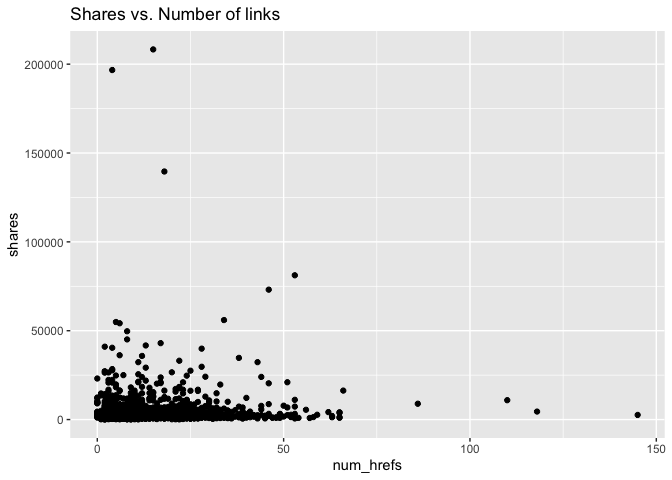
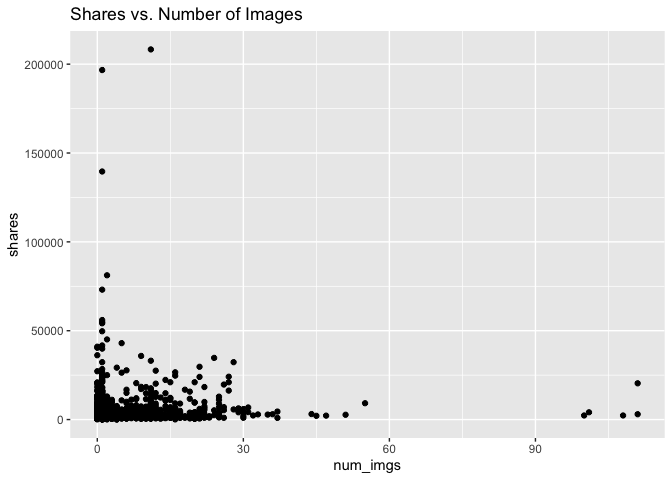
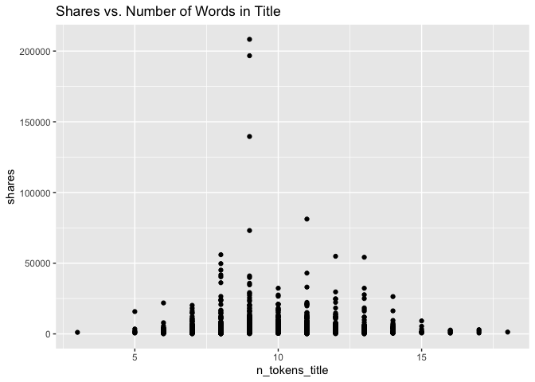
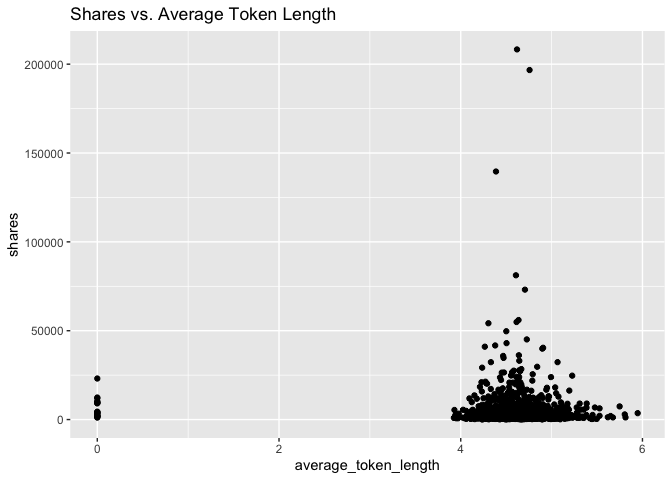

Project 3
================
Nicole Levin
11/14/22

# Analysis of lifestyle channel

## Introduction

This report analyzes one data channel of a dataset of features about
articles published by Mashable over a two year period. This report
contains some summary statistics and plots, model-fitting for a linear
regression model and a boosted tree, and a comparison of the predictive
abilities of the two models. There are six data channels in the complete
dataset: lifestyle, entertainment, business, social media, technology,
and world. Results for the other channels can be seen in their
respective reports. The full dataset contains 61 attributes for each
article, but we will focus our attention on the following six predictor
variables for summarizing and modeling.

1.  num_hrefs: Number of links
2.  n_tokens_title: Number of words in the title
3.  kw_avg_avg: Average keyword
4.  average_token_length: Average length of the words in the content
5.  num_imgs: Number of images
6.  n_non_stop_unique_tokens: Rate of unique non-stop words in the
    content

The packages required for creating this report are the following:

1.  `tidyverse`
2.  `caret`
3.  `leaps`
4.  `rmarkdown`
5.  `knitr`

We will start with loading the required packages and reading in the
data.

``` r
#Load packages
library(tidyverse)
library(caret)
library(leaps)
library(rmarkdown)
library(knitr)

#Use a relative path to import data. 
news_data <- read_csv("OnlineNewsPopularity.csv")
```

    ## Rows: 39644 Columns: 61
    ## ── Column specification ───────────────────────────────────────────────────────────────────────────
    ## Delimiter: ","
    ## chr  (1): url
    ## dbl (60): timedelta, n_tokens_title, n_tokens_content, n_unique_tokens, n_non_stop_words, n_non...
    ## 
    ## ℹ Use `spec()` to retrieve the full column specification for this data.
    ## ℹ Specify the column types or set `show_col_types = FALSE` to quiet this message.

``` r
#Filter data for just the desired channel.
channel_filter <- paste0("data_channel_is_", params[[1]])
selected_data <- filter(news_data, get(channel_filter) == 1)
selected_data <- selected_data %>% select(num_hrefs, n_tokens_title, kw_avg_avg, average_token_length, num_imgs, n_non_stop_unique_tokens, shares)
```

## Summary Statistics

Before modeling, we’ll look at some basic summary statistics and graphs,
starting with a summary table of means and standard deviations of all of
our variables of interest. These will give us an idea of the center and
spread of the distributions of each of our variables.

``` r
#Calculate means and standard deviations
col_means <- colMeans(selected_data)
col_sds <- apply(selected_data,2,sd)

#Put into a table
data_table <- rbind(t(col_means), t(col_sds))
row.names(data_table) <- c("Mean", "Std. Dev.")
kable(data_table)
```

|           | num_hrefs | n_tokens_title | kw_avg_avg | average_token_length | num_imgs | n_non_stop_unique_tokens |   shares |
|:----------|----------:|---------------:|-----------:|---------------------:|---------:|-------------------------:|---------:|
| Mean      |  13.41925 |       9.765603 |   3418.686 |            4.5880959 | 4.904717 |                0.6834217 | 3682.123 |
| Std. Dev. |  11.53056 |       1.909371 |   1364.968 |            0.5427736 | 8.150601 |                0.1160655 | 8885.017 |

Next, we will look at a scatterplot of number of links vs. shares. An
upward trend in this graph would indicate that articles with additional
links tend to be shared more often. A downward trend would indicate that
articles with additional links tend to be shared less often.

``` r
#Create a scatterplot for num_hrefs vs shares
g <- ggplot(data=selected_data, aes(x=num_hrefs, y=shares))
g + geom_point() + labs(title = "Shares vs. Number of links")
```

<!-- -->

Next, we will look at a scatterplot of number of images vs. shares. An
upward trend in this graph would indicate that articles with more images
tend to be shared more often. A downward trend would indicate that
articles with additional images tend to be shared less often.

``` r
#Plot num_imgs vs shares
g <- ggplot(data=selected_data, aes(x=num_imgs, y=shares))
g + geom_point() + labs(title = "Shares vs. Number of Images")
```

<!-- -->

Next, we will look at a scatterplot of number of words in the title
vs. shares. An upward trend in this graph would indicate that articles
with additional words in the title tend to be shared more often. A
downward trend would indicate that articles with additional words in the
title tend to be shared less often.

``` r
#Plot words in title vs. shares
g <- ggplot(data=selected_data, aes(x=n_tokens_title, y=shares))
g + geom_point() + labs(title = "Shares vs. Number of Words in Title")
```

<!-- -->

Next, we will look at a scatterplot of average word length vs. shares.
An upward trend in this graph would indicate that articles with a larger
average word length tend to be shared more often. A downward trend would
indicate that articles with a larger average word length tend to be
shared less often.

``` r
#Plot average word length vs. shares
g <- ggplot(data=selected_data, aes(x=average_token_length, y=shares))
g + geom_point() + labs(title = "Shares vs. Average Token Length")
```

<!-- -->

## Model Preparation

Next, we will prepare for modeling by splitting the data into a training
and test set. We will use the training set to fit two models, a linear
regression and a boosted tree. The test set will be then used to
evaluate the abilities of the models to predict out of sample results
for number of shares.

``` r
#Split data for modeling into train and test sets.
set.seed(371)
train_index <- createDataPartition(selected_data$shares, p=0.7, list=FALSE)
data_train <- selected_data[train_index, ]
data_test <- selected_data[-train_index, ]
```

## Linear Regression Model

The first model we will look at is a basic linear regression model. In
linear regression, the best-fit model is found by minimizing the sum of
the squares of the residuals. The parameter estimates are then used in
the regression equation for prediction of future values, finding
confidence intervals for mean values, etc. Linear regression is often
the simplest option and can be more interpretable than some of the
ensemble methods, but it often loses out when prediction is the most
important goal.

``` r
#Create a linear regression. 
linear_reg <- lm(shares ~ num_hrefs + n_tokens_title + num_imgs + average_token_length + kw_avg_avg + n_non_stop_unique_tokens, data = data_train)
summary(linear_reg)
```

    ## 
    ## Call:
    ## lm(formula = shares ~ num_hrefs + n_tokens_title + num_imgs + 
    ##     average_token_length + kw_avg_avg + n_non_stop_unique_tokens, 
    ##     data = data_train)
    ## 
    ## Residuals:
    ##    Min     1Q Median     3Q    Max 
    ##  -7927  -2627  -1816   -226 202320 
    ## 
    ## Coefficients:
    ##                            Estimate Std. Error t value Pr(>|t|)   
    ## (Intercept)               4454.9719  2494.6005   1.786  0.07433 . 
    ## num_hrefs                   52.3705    24.4659   2.141  0.03248 * 
    ## n_tokens_title             -18.1522   118.2496  -0.154  0.87802   
    ## num_imgs                    34.9501    32.0489   1.091  0.27566   
    ## average_token_length     -1396.2360   535.0519  -2.610  0.00916 **
    ## kw_avg_avg                   0.4222     0.1745   2.419  0.01567 * 
    ## n_non_stop_unique_tokens  5236.8593  2713.3714   1.930  0.05380 . 
    ## ---
    ## Signif. codes:  0 '***' 0.001 '**' 0.01 '*' 0.05 '.' 0.1 ' ' 1
    ## 
    ## Residual standard error: 8687 on 1465 degrees of freedom
    ## Multiple R-squared:  0.0142, Adjusted R-squared:  0.01016 
    ## F-statistic: 3.518 on 6 and 1465 DF,  p-value: 0.001847

## Boosted Tree Model

Tree-based methods are another modeling option available. The
methodology for trees is to split the predictor space into regions with
different predictions for each region. Boosting trees is a way to
improve the predictive ability over a single tree fit. Boosting is slow
fitting of trees where trees are grown sequentially. Each tree grown on
a modified version of the original data and the predictions update as
the trees grow. Boosting typically improves the predictive performance
over a single tree fit.

``` r
#Create a boosted tree fit. 
tuneGrid = expand.grid(n.trees = c(25, 50, 100, 150, 200), interaction.depth = 1:4, shrinkage = c(0.05, 0.1, 0.2), n.minobsinnode = 10)
boosted_tree <- train(shares ~ ., data = data_train, method = "gbm", 
                      preProcess = c("center", "scale"),
                      trControl = trainControl(method = "cv", number = 10), 
                      tuneGrid = tuneGrid, verbose = FALSE)
boosted_tree
```

    ## Stochastic Gradient Boosting 
    ## 
    ## 1472 samples
    ##    6 predictor
    ## 
    ## Pre-processing: centered (6), scaled (6) 
    ## Resampling: Cross-Validated (10 fold) 
    ## Summary of sample sizes: 1326, 1324, 1324, 1325, 1325, 1324, ... 
    ## Resampling results across tuning parameters:
    ## 
    ##   shrinkage  interaction.depth  n.trees  RMSE      Rsquared     MAE     
    ##   0.05       1                   25      7659.325  0.003282159  3465.490
    ##   0.05       1                   50      7695.155  0.003317734  3482.818
    ##   0.05       1                  100      7708.179  0.002833654  3492.589
    ##   0.05       1                  150      7738.917  0.003404883  3499.552
    ##   0.05       1                  200      7748.572  0.004023765  3495.338
    ##   0.05       2                   25      7641.453  0.006140907  3458.508
    ##   0.05       2                   50      7718.109  0.005912996  3491.849
    ##   0.05       2                  100      7779.231  0.005824795  3485.785
    ##   0.05       2                  150      7806.634  0.006379230  3512.921
    ##   0.05       2                  200      7866.167  0.005756395  3529.070
    ##   0.05       3                   25      7645.787  0.007653301  3450.085
    ##   0.05       3                   50      7720.996  0.011644985  3473.542
    ##   0.05       3                  100      7777.423  0.010094444  3490.586
    ##   0.05       3                  150      7868.238  0.009246275  3524.183
    ##   0.05       3                  200      7912.085  0.009494040  3556.959
    ##   0.05       4                   25      7667.971  0.004389194  3459.081
    ##   0.05       4                   50      7734.201  0.006587585  3480.362
    ##   0.05       4                  100      7787.908  0.008177188  3499.267
    ##   0.05       4                  150      7893.100  0.006603045  3556.608
    ##   0.05       4                  200      7984.525  0.005850762  3607.408
    ##   0.10       1                   25      7704.743  0.003887511  3489.555
    ##   0.10       1                   50      7706.816  0.004270023  3471.434
    ##   0.10       1                  100      7763.898  0.004422957  3486.184
    ##   0.10       1                  150      7810.499  0.004041940  3510.046
    ##   0.10       1                  200      7827.583  0.003214093  3529.595
    ##   0.10       2                   25      7720.331  0.006481025  3482.758
    ##   0.10       2                   50      7753.034  0.005871423  3475.700
    ##   0.10       2                  100      7849.755  0.003811143  3526.330
    ##   0.10       2                  150      7966.989  0.005744090  3573.927
    ##   0.10       2                  200      8051.439  0.005271229  3561.111
    ##   0.10       3                   25      7754.891  0.006490857  3502.000
    ##   0.10       3                   50      7839.417  0.008080554  3530.956
    ##   0.10       3                  100      7927.288  0.006895531  3571.118
    ##   0.10       3                  150      8055.337  0.006974704  3624.062
    ##   0.10       3                  200      8178.320  0.005823322  3641.504
    ##   0.10       4                   25      7749.638  0.014798814  3505.500
    ##   0.10       4                   50      7865.789  0.011560405  3545.936
    ##   0.10       4                  100      8034.737  0.009833285  3644.249
    ##   0.10       4                  150      8184.400  0.008189587  3734.598
    ##   0.10       4                  200      8282.406  0.007004837  3787.238
    ##   0.20       1                   25      7707.378  0.003835046  3458.694
    ##   0.20       1                   50      7844.581  0.002492225  3530.665
    ##   0.20       1                  100      7850.495  0.003487385  3544.058
    ##   0.20       1                  150      7944.051  0.004328759  3564.561
    ##   0.20       1                  200      7934.861  0.005367109  3529.233
    ##   0.20       2                   25      7829.274  0.008068426  3495.386
    ##   0.20       2                   50      7892.326  0.009923455  3525.126
    ##   0.20       2                  100      8128.666  0.009886206  3619.375
    ##   0.20       2                  150      8334.940  0.010909160  3696.395
    ##   0.20       2                  200      8549.291  0.010128904  3790.538
    ##   0.20       3                   25      7841.690  0.005833117  3533.930
    ##   0.20       3                   50      8039.114  0.007503252  3611.764
    ##   0.20       3                  100      8370.462  0.006304361  3746.341
    ##   0.20       3                  150      8571.860  0.008157686  3855.165
    ##   0.20       3                  200      8721.853  0.009694305  3928.043
    ##   0.20       4                   25      7896.189  0.006554856  3574.662
    ##   0.20       4                   50      8064.300  0.006082756  3644.903
    ##   0.20       4                  100      8461.235  0.004541578  3883.849
    ##   0.20       4                  150      8703.097  0.003384969  3975.756
    ##   0.20       4                  200      8889.170  0.004666481  4073.438
    ## 
    ## Tuning parameter 'n.minobsinnode' was held constant at a value of 10
    ## RMSE was used to select the optimal model using the smallest value.
    ## The final values used for the model were n.trees = 25, interaction.depth = 2, shrinkage = 0.05
    ##  and n.minobsinnode = 10.

## Model Comparison

Now the two models will be compared based on their ability to predict
out of sample results for number of shares. The model with the lower
RMSE will be selected as the better model.

``` r
#Make predictions using the test data
pred_reg <- predict(linear_reg, newdata = data_test)
pred_boost <- predict(boosted_tree, newdata = data_test)
results_reg <- postResample(pred_reg, obs = data_test$shares)
results_boost <- postResample(pred_boost, obs = data_test$shares)

#Create table of results
results_table <- rbind(t(results_reg), t(results_boost))
row.names(results_table) <- c("Linear Regression", "Boosted Tree")
kable(results_table)
```

|                   |     RMSE |  Rsquared |      MAE |
|:------------------|---------:|----------:|---------:|
| Linear Regression | 9199.639 | 0.0085197 | 3143.117 |
| Boosted Tree      | 9211.951 | 0.0052193 | 3104.942 |

``` r
#Select the better model
if(results_reg[1] < results_boost[1]){winner <- "linear regression"
  } else{winner <- "boosted tree"}
```

Based on resulting RMSE, the better performing model for prediction is
the linear regression model.

## Citation

Data used to prepare this report is from:

K. Fernandes, P. Vinagre and P. Cortez. A Proactive Intelligent Decision
Support System for Predicting the Popularity of Online News. Proceedings
of the 17th EPIA 2015 - Portuguese Conference on Artificial
Intelligence, September, Coimbra, Portugal.
