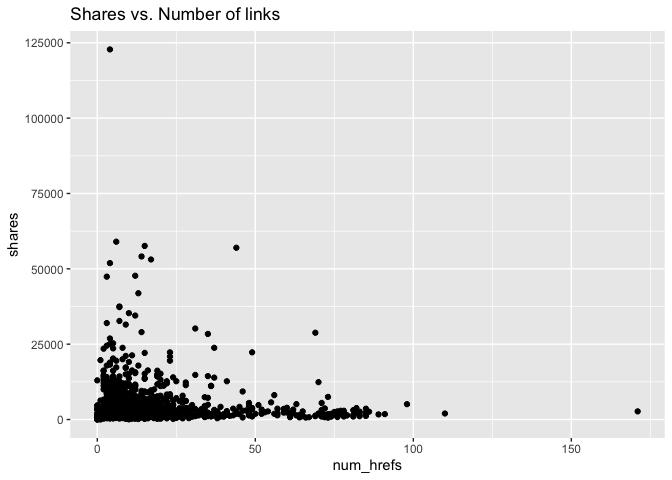

Project 3
================
Nicole Levin
11/14/22

# Analysis of socmed channel

## Introduction

This report analyzes one data channel of a dataset of features about
articles published by Mashable over a two year period. This report
contains some summary statistics and plots, model-fitting for a linear
regression model and a boosted tree, and a comparison of the predictive
abilities of the two models. There are six data channels in the complete
dataset: lifestyle, entertainment, business, social media, technology,
and world. Results for the other channels can be seen in their
respective reports. The full dataset contains 61 attributes for each
article, but we will focus our attention on the following six predictor
variables for summarizing and modeling.

1.  num_hrefs: Number of links
2.  n_tokens_title: Number of words in the title
3.  kw_avg_avg: Average keyword
4.  average_token_length: Average length of the words in the content
5.  num_imgs: Number of images
6.  n_non_stop_unique_tokens: Rate of unique non-stop words in the
    content

The packages required for creating this report are the following:

1.  `tidyverse`
2.  `caret`
3.  `leaps`
4.  `rmarkdown`
5.  `knitr`

We will start with loading the required packages and reading in the
data.

``` r
#Load packages
library(tidyverse)
library(caret)
library(leaps)
library(rmarkdown)
library(knitr)

#Use a relative path to import data. 
news_data <- read_csv("OnlineNewsPopularity.csv")
```

    ## Rows: 39644 Columns: 61
    ## ── Column specification ───────────────────────────────────────────────────────────────────────────
    ## Delimiter: ","
    ## chr  (1): url
    ## dbl (60): timedelta, n_tokens_title, n_tokens_content, n_unique_tokens, n_non_stop_words, n_non...
    ## 
    ## ℹ Use `spec()` to retrieve the full column specification for this data.
    ## ℹ Specify the column types or set `show_col_types = FALSE` to quiet this message.

``` r
#Filter data for just the desired channel.
channel_filter <- paste0("data_channel_is_", params[[1]])
selected_data <- filter(news_data, get(channel_filter) == 1)
selected_data <- selected_data %>% select(num_hrefs, n_tokens_title, kw_avg_avg, average_token_length, num_imgs, n_non_stop_unique_tokens, shares)
```

## Summary Statistics

Before modeling, we’ll look at some basic summary statistics and graphs,
starting with a summary table of means and standard deviations of all of
our variables of interest. These will give us an idea of the center and
spread of the distributions of each of our variables.

``` r
#Calculate means and standard deviations
col_means <- colMeans(selected_data)
col_sds <- apply(selected_data,2,sd)

#Put into a table
data_table <- rbind(t(col_means), t(col_sds))
row.names(data_table) <- c("Mean", "Std. Dev.")
kable(data_table)
```

|           | num_hrefs | n_tokens_title | kw_avg_avg | average_token_length | num_imgs | n_non_stop_unique_tokens |   shares |
|:----------|----------:|---------------:|-----------:|---------------------:|---------:|-------------------------:|---------:|
| Mean      |  13.17607 |       9.632802 |   3223.723 |            4.6325818 | 4.290142 |                0.6822936 | 3629.383 |
| Std. Dev. |  15.52699 |       2.102230 |   1329.443 |            0.4167644 | 8.201711 |                0.1158418 | 5524.167 |

Next, we will look at a scatterplot of number of links vs. shares. An
upward trend in this graph would indicate that articles with additional
links tend to be shared more often. A downward trend would indicate that
articles with additional links tend to be shared less often.

``` r
#Create a scatterplot for num_hrefs vs shares
g <- ggplot(data=selected_data, aes(x=num_hrefs, y=shares))
g + geom_point() + labs(title = "Shares vs. Number of links")
```

<!-- -->

Next, we will look at a scatterplot of number of images vs. shares. An
upward trend in this graph would indicate that articles with more images
tend to be shared more often. A downward trend would indicate that
articles with additional images tend to be shared less often.

``` r
#Plot num_imgs vs shares
g <- ggplot(data=selected_data, aes(x=num_imgs, y=shares))
g + geom_point() + labs(title = "Shares vs. Number of Images")
```

<!-- -->

Next, we will look at a scatterplot of number of words in the title
vs. shares. An upward trend in this graph would indicate that articles
with additional words in the title tend to be shared more often. A
downward trend would indicate that articles with additional words in the
title tend to be shared less often.

``` r
#Plot words in title vs. shares
g <- ggplot(data=selected_data, aes(x=n_tokens_title, y=shares))
g + geom_point() + labs(title = "Shares vs. Number of Words in Title")
```

<!-- -->

Next, we will look at a scatterplot of average word length vs. shares.
An upward trend in this graph would indicate that articles with a larger
average word length tend to be shared more often. A downward trend would
indicate that articles with a larger average word length tend to be
shared less often.

``` r
#Plot average word length vs. shares
g <- ggplot(data=selected_data, aes(x=average_token_length, y=shares))
g + geom_point() + labs(title = "Shares vs. Average Token Length")
```

<!-- -->

## Model Preparation

Next, we will prepare for modeling by splitting the data into a training
and test set. We will use the training set to fit two models, a linear
regression and a boosted tree. The test set will be then used to
evaluate the abilities of the models to predict out of sample results
for number of shares.

``` r
#Split data for modeling into train and test sets.
set.seed(371)
train_index <- createDataPartition(selected_data$shares, p=0.7, list=FALSE)
data_train <- selected_data[train_index, ]
data_test <- selected_data[-train_index, ]
```

## Linear Regression Model

The first model we will look at is a basic linear regression model. In
linear regression, the best-fit model is found by minimizing the sum of
the squares of the residuals. The parameter estimates are then used in
the regression equation for prediction of future values, finding
confidence intervals for mean values, etc. Linear regression is often
the simplest option and can be more interpretable than some of the
ensemble methods, but it often loses out when prediction is the most
important goal.

``` r
#Create a linear regression. 
linear_reg <- lm(shares ~ num_hrefs + n_tokens_title + num_imgs + average_token_length + kw_avg_avg + n_non_stop_unique_tokens, data = data_train)
summary(linear_reg)
```

    ## 
    ## Call:
    ## lm(formula = shares ~ num_hrefs + n_tokens_title + num_imgs + 
    ##     average_token_length + kw_avg_avg + n_non_stop_unique_tokens, 
    ##     data = data_train)
    ## 
    ## Residuals:
    ##    Min     1Q Median     3Q    Max 
    ## -11919  -1986  -1264    219  49503 
    ## 
    ## Coefficients:
    ##                            Estimate Std. Error t value Pr(>|t|)    
    ## (Intercept)               4.313e+03  1.405e+03   3.069  0.00219 ** 
    ## num_hrefs                -9.076e+00  9.422e+00  -0.963  0.33553    
    ## n_tokens_title           -3.612e+01  5.183e+01  -0.697  0.48602    
    ## num_imgs                 -4.583e+01  1.712e+01  -2.677  0.00750 ** 
    ## average_token_length      5.718e+02  2.955e+02   1.935  0.05316 .  
    ## kw_avg_avg                3.226e-01  7.682e-02   4.200 2.82e-05 ***
    ## n_non_stop_unique_tokens -5.588e+03  1.143e+03  -4.891 1.10e-06 ***
    ## ---
    ## Signif. codes:  0 '***' 0.001 '**' 0.01 '*' 0.05 '.' 0.1 ' ' 1
    ## 
    ## Residual standard error: 4412 on 1621 degrees of freedom
    ## Multiple R-squared:  0.02486,    Adjusted R-squared:  0.02125 
    ## F-statistic: 6.888 on 6 and 1621 DF,  p-value: 3.086e-07

## Boosted Tree Model

Tree-based methods are another modeling option available. The
methodology for trees is to split the predictor space into regions with
different predictions for each region. Boosting trees is a way to
improve the predictive ability over a single tree fit. Boosting is slow
fitting of trees where trees are grown sequentially. Each tree grown on
a modified version of the original data and the predictions update as
the trees grow. Boosting typically improves the predictive performance
over a single tree fit.

``` r
#Create a boosted tree fit. 
tuneGrid = expand.grid(n.trees = c(25, 50, 100, 150, 200), interaction.depth = 1:4, shrinkage = c(0.05, 0.1, 0.2), n.minobsinnode = 10)
boosted_tree <- train(shares ~ ., data = data_train, method = "gbm", 
                      preProcess = c("center", "scale"),
                      trControl = trainControl(method = "cv", number = 10), 
                      tuneGrid = tuneGrid, verbose = FALSE)
boosted_tree
```

    ## Stochastic Gradient Boosting 
    ## 
    ## 1628 samples
    ##    6 predictor
    ## 
    ## Pre-processing: centered (6), scaled (6) 
    ## Resampling: Cross-Validated (10 fold) 
    ## Summary of sample sizes: 1466, 1465, 1466, 1465, 1465, 1466, ... 
    ## Resampling results across tuning parameters:
    ## 
    ##   shrinkage  interaction.depth  n.trees  RMSE      Rsquared    MAE     
    ##   0.05       1                   25      4332.987  0.02832581  2486.517
    ##   0.05       1                   50      4316.209  0.03409598  2468.246
    ##   0.05       1                  100      4307.834  0.03878590  2448.880
    ##   0.05       1                  150      4305.439  0.04054334  2446.565
    ##   0.05       1                  200      4305.568  0.04067102  2440.007
    ##   0.05       2                   25      4321.999  0.03234102  2482.514
    ##   0.05       2                   50      4317.562  0.03397863  2460.645
    ##   0.05       2                  100      4309.892  0.04035067  2443.722
    ##   0.05       2                  150      4313.981  0.04216155  2442.883
    ##   0.05       2                  200      4322.783  0.04424014  2461.386
    ##   0.05       3                   25      4327.308  0.02971661  2476.677
    ##   0.05       3                   50      4323.655  0.03219694  2454.655
    ##   0.05       3                  100      4326.381  0.03743646  2447.816
    ##   0.05       3                  150      4343.178  0.03783759  2461.947
    ##   0.05       3                  200      4361.895  0.03562421  2470.820
    ##   0.05       4                   25      4331.222  0.02464425  2478.434
    ##   0.05       4                   50      4329.928  0.03020091  2460.709
    ##   0.05       4                  100      4344.560  0.03602808  2449.549
    ##   0.05       4                  150      4353.961  0.03857500  2466.970
    ##   0.05       4                  200      4374.932  0.03747850  2479.896
    ##   0.10       1                   25      4308.578  0.03684943  2473.651
    ##   0.10       1                   50      4304.021  0.04061812  2453.446
    ##   0.10       1                  100      4304.142  0.04078035  2446.220
    ##   0.10       1                  150      4305.417  0.04254686  2434.906
    ##   0.10       1                  200      4312.061  0.04199393  2440.438
    ##   0.10       2                   25      4305.081  0.04017169  2443.634
    ##   0.10       2                   50      4308.592  0.04142587  2428.344
    ##   0.10       2                  100      4329.697  0.04392000  2447.560
    ##   0.10       2                  150      4347.292  0.04393462  2481.782
    ##   0.10       2                  200      4361.435  0.04550710  2504.170
    ##   0.10       3                   25      4345.924  0.02503630  2479.530
    ##   0.10       3                   50      4367.618  0.02538091  2469.613
    ##   0.10       3                  100      4385.370  0.03046928  2478.345
    ##   0.10       3                  150      4406.367  0.03594744  2500.922
    ##   0.10       3                  200      4428.039  0.03461323  2530.261
    ##   0.10       4                   25      4346.470  0.02406995  2467.823
    ##   0.10       4                   50      4357.073  0.03295008  2467.810
    ##   0.10       4                  100      4407.297  0.03258823  2522.623
    ##   0.10       4                  150      4469.477  0.03066921  2583.091
    ##   0.10       4                  200      4502.035  0.03003111  2614.603
    ##   0.20       1                   25      4293.493  0.04358525  2439.942
    ##   0.20       1                   50      4297.004  0.04474329  2432.375
    ##   0.20       1                  100      4310.998  0.04340050  2437.119
    ##   0.20       1                  150      4333.034  0.04172185  2460.381
    ##   0.20       1                  200      4314.449  0.04847421  2450.431
    ##   0.20       2                   25      4339.833  0.03418883  2469.147
    ##   0.20       2                   50      4359.971  0.03508153  2494.498
    ##   0.20       2                  100      4380.579  0.04052712  2525.865
    ##   0.20       2                  150      4408.350  0.04167571  2564.152
    ##   0.20       2                  200      4437.166  0.04152248  2593.699
    ##   0.20       3                   25      4316.972  0.04455776  2461.779
    ##   0.20       3                   50      4398.804  0.03725176  2522.139
    ##   0.20       3                  100      4452.838  0.03105363  2576.322
    ##   0.20       3                  150      4524.008  0.03026612  2613.578
    ##   0.20       3                  200      4531.790  0.03250195  2644.913
    ##   0.20       4                   25      4406.760  0.02962336  2517.707
    ##   0.20       4                   50      4435.339  0.03255808  2555.941
    ##   0.20       4                  100      4549.443  0.02968549  2680.454
    ##   0.20       4                  150      4652.175  0.02454045  2766.177
    ##   0.20       4                  200      4737.086  0.01911941  2829.409
    ## 
    ## Tuning parameter 'n.minobsinnode' was held constant at a value of 10
    ## RMSE was used to select the optimal model using the smallest value.
    ## The final values used for the model were n.trees = 25, interaction.depth = 1, shrinkage = 0.2
    ##  and n.minobsinnode = 10.

## Model Comparison

Now the two models will be compared based on their ability to predict
out of sample results for number of shares. The model with the lower
RMSE will be selected as the better model.

``` r
#Make predictions using the test data
pred_reg <- predict(linear_reg, newdata = data_test)
pred_boost <- predict(boosted_tree, newdata = data_test)
results_reg <- postResample(pred_reg, obs = data_test$shares)
results_boost <- postResample(pred_boost, obs = data_test$shares)

#Create table of results
results_table <- rbind(t(results_reg), t(results_boost))
row.names(results_table) <- c("Linear Regression", "Boosted Tree")
kable(results_table)
```

|                   |     RMSE |  Rsquared |      MAE |
|:------------------|---------:|----------:|---------:|
| Linear Regression | 7382.161 | 0.0202318 | 2785.493 |
| Boosted Tree      | 7374.955 | 0.0196683 | 2804.244 |

``` r
#Select the better model
if(results_reg[1] < results_boost[1]){winner <- "linear regression"
  } else{winner <- "boosted tree"}
```

Based on resulting RMSE, the better performing model for prediction is
the boosted tree model.

## Citation

Data used to prepare this report is from:

K. Fernandes, P. Vinagre and P. Cortez. A Proactive Intelligent Decision
Support System for Predicting the Popularity of Online News. Proceedings
of the 17th EPIA 2015 - Portuguese Conference on Artificial
Intelligence, September, Coimbra, Portugal.
