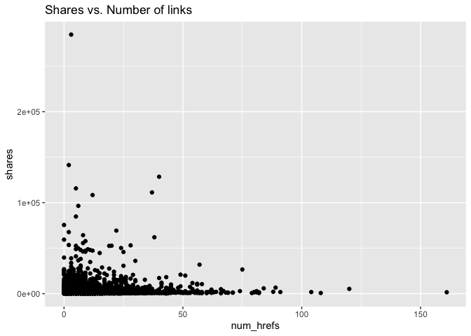
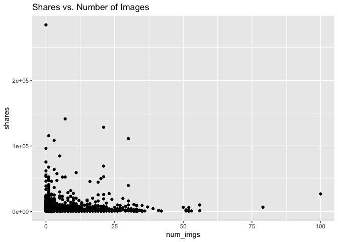
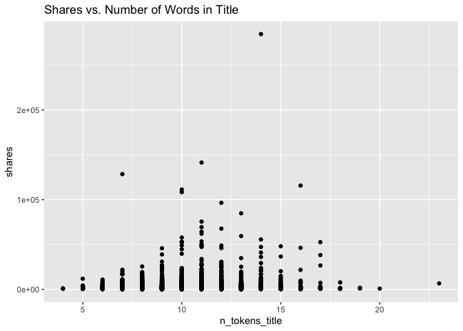
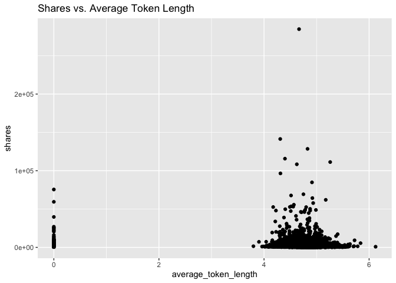

Project 3
================
Nicole Levin
2022-11-07

# Analysis of world channel

## Introduction

This report analyzes one data channel of a dataset of features about
articles published by Mashable in a period of two years. This report
contains some summary statistics and plots, model-fitting for a linear
regression model and a boosted tree, and a comparison of the predictive
abilities of the two models. There are six data channels in the complete
dataset: lifestyle, entertainment, business, social media, technology,
and world. Results for the other channels can be seen in their
respective reports. The full dataset contains 61 attributes for each
article, but we will focus our attention on the following six for
summarizing and modeling.

1.  num_hrefs: Number of links
2.  n_tokens_title: Number of words in the title
3.  kw_avg_avg: Average keyword
4.  average_token_length: Average length of the words in the content
5.  num_imgs: Number of images
6.  n_non_stop_unique_tokens: Rate of unique non-stop words in the
    content

The packages required for creating this report are the following:

1.  `tidyverse`
2.  `caret`
3.  `leaps`
4.  `rmarkdown`
5.  `knitr`

We will start with loading the required packages and reading in the
data.

``` r
#Load packages
library(tidyverse)
library(caret)
library(leaps)
library(rmarkdown)
library(knitr)

#Use a relative path to import data. 
news_data <- read_csv("OnlineNewsPopularity.csv")
```

    ## Rows: 39644 Columns: 61
    ## ── Column specification ───────────────────────────────────────────────────────────────────────────
    ## Delimiter: ","
    ## chr  (1): url
    ## dbl (60): timedelta, n_tokens_title, n_tokens_content, n_unique_tokens, n_non_stop_words, n_non...
    ## 
    ## ℹ Use `spec()` to retrieve the full column specification for this data.
    ## ℹ Specify the column types or set `show_col_types = FALSE` to quiet this message.

``` r
#Filter data for just the desired channel.
channel_filter <- paste0("data_channel_is_", params[[1]])
selected_data <- filter(news_data, get(channel_filter) == 1)
selected_data <- selected_data %>% select(num_hrefs, n_tokens_title, kw_avg_avg, average_token_length, num_imgs, n_non_stop_unique_tokens, shares)
```

## Summary Statistics

Before modeling, we’ll look at some basic summary statistics and graphs,
starting with a summary table of means and standard deviations of all of
our variables of interest.

``` r
#Calculate means and standard deviations
col_means <- colMeans(selected_data)
col_sds <- apply(selected_data,2,sd)

#Put into a table
data_table <- rbind(t(col_means), t(col_sds))
row.names(data_table) <- c("Mean", "Std. Dev.")
kable(data_table)
```

|           | num_hrefs | n_tokens_title | kw_avg_avg | average_token_length | num_imgs | n_non_stop_unique_tokens |   shares |
|:----------|----------:|---------------:|-----------:|---------------------:|---------:|-------------------------:|---------:|
| Mean      | 10.195206 |      10.599027 |  2524.7406 |            4.6781214 | 2.841225 |                0.6652934 | 2287.734 |
| Std. Dev. |  9.226685 |       2.083929 |   853.3302 |            0.8650829 | 5.217095 |                0.1453257 | 6089.669 |

Next, we will look at a scatterplot of number of links vs. shares. An
upward trend in this graph would indicate that articles with additional
links tend to be shared more often.

``` r
#Create a scatterplot for num_hrefs vs shares
g <- ggplot(data=selected_data, aes(x=num_hrefs, y=shares))
g + geom_point() + labs(title = "Shares vs. Number of links")
```

<!-- -->

Next, we will look at a scatterplot of number of images vs. shares. An
upward trend in this graph would indicate that articles with more images
tend to be shared more often.

``` r
#Plot num_imgs vs shares
g <- ggplot(data=selected_data, aes(x=num_imgs, y=shares))
g + geom_point() + labs(title = "Shares vs. Number of Images")
```

<!-- -->

Next, we will look at a scatterplot of number of words in the title
vs. shares. An upward trend in this graph would indicate that articles
with additional words in the title tend to be shared more often.

``` r
g <- ggplot(data=selected_data, aes(x=n_tokens_title, y=shares))
g + geom_point() + labs(title = "Shares vs. Number of Words in Title")
```

<!-- -->

Next, we will look at a scatterplot of average word length vs. shares.
An upward trend in this graph would indicate that articles with a larger
average word length tend to be shared more often.

``` r
g <- ggplot(data=selected_data, aes(x=average_token_length, y=shares))
g + geom_point() + labs(title = "Shares vs. Average Token Length")
```

<!-- -->

## Model Preparation

Next, we will prepare for modeling by splitting the data into a training
and test set. We will use the training set to fit two models, a linear
regression and a boosted tree. The test set will be then used to
evaluate the abilities of the models to predict out of sample results
for number of shares.

``` r
#Split data for modeling into train and test sets.
set.seed(371)
train_index <- createDataPartition(selected_data$shares, p=0.7, list=FALSE)
data_train <- selected_data[train_index, ]
data_test <- selected_data[-train_index, ]
```

## Linear Regression Model

The first model we will look at is a basic linear regression model. In
linear regression, the best-fit model is found by minimizing the sum of
the squares of the residuals. The parameter estimates are then used in
the regression equation for prediction of future values, finding
confidence intervals for mean values, etc. Linear regression is often
the simplest option and can be more interpretable than some of the
ensemble methods, but it often loses out when prediction is the most
important goal.

``` r
#Create a linear regression. 
linear_reg <- lm(shares ~ num_hrefs + n_tokens_title + num_imgs + average_token_length + kw_avg_avg + n_non_stop_unique_tokens, data = data_train)
summary(linear_reg)
```

    ## 
    ## Call:
    ## lm(formula = shares ~ num_hrefs + n_tokens_title + num_imgs + 
    ##     average_token_length + kw_avg_avg + n_non_stop_unique_tokens, 
    ##     data = data_train)
    ## 
    ## Residuals:
    ##    Min     1Q Median     3Q    Max 
    ##  -8147  -1408   -875   -169 282006 
    ## 
    ## Coefficients:
    ##                            Estimate Std. Error t value Pr(>|t|)    
    ## (Intercept)               823.87082  676.90986   1.217  0.22361    
    ## num_hrefs                  27.53937    9.69008   2.842  0.00450 ** 
    ## n_tokens_title            105.39732   37.77980   2.790  0.00529 ** 
    ## num_imgs                   93.76231   17.21786   5.446 5.37e-08 ***
    ## average_token_length     -928.34016  159.96785  -5.803 6.84e-09 ***
    ## kw_avg_avg                  0.49247    0.09325   5.281 1.33e-07 ***
    ## n_non_stop_unique_tokens 4347.24057  979.92054   4.436 9.32e-06 ***
    ## ---
    ## Signif. codes:  0 '***' 0.001 '**' 0.01 '*' 0.05 '.' 0.1 ' ' 1
    ## 
    ## Residual standard error: 6043 on 5893 degrees of freedom
    ## Multiple R-squared:  0.01882,    Adjusted R-squared:  0.01783 
    ## F-statistic: 18.84 on 6 and 5893 DF,  p-value: < 2.2e-16

## Boosted Tree Model

Tree-based methods are another modeling option available. The
methodology for trees is to split the predictor space into regions with
different predictions for each region. Boosting trees is a way to
improve the predictive ability over a single tree fit. Boosting is slow
fitting of trees where trees are grown sequentially. Each tree grown on
a modified version of the original data and the predictions update as
the trees grow. Boosting typically improves the predictive performance
over a single tree fit.

``` r
#Create a boosted tree fit. Right now the tuning grid just matches the one from the homework. There could be room for improvement there.
tuneGrid = expand.grid(n.trees = c(25, 50, 100, 150, 200), interaction.depth = 1:4, shrinkage = 0.1, n.minobsinnode = 10)
boosted_tree <- train(shares ~ ., data = data_train, method = "gbm", 
                      preProcess = c("center", "scale"),
                      trControl = trainControl(method = "cv", number = 10), 
                      tuneGrid = tuneGrid, verbose = FALSE)
boosted_tree
```

    ## Stochastic Gradient Boosting 
    ## 
    ## 5900 samples
    ##    6 predictor
    ## 
    ## Pre-processing: centered (6), scaled (6) 
    ## Resampling: Cross-Validated (10 fold) 
    ## Summary of sample sizes: 5310, 5309, 5310, 5311, 5310, 5311, ... 
    ## Resampling results across tuning parameters:
    ## 
    ##   interaction.depth  n.trees  RMSE      Rsquared    MAE     
    ##   1                   25      5480.244  0.02254449  1878.847
    ##   1                   50      5474.468  0.02612467  1858.519
    ##   1                  100      5473.754  0.02890308  1863.400
    ##   1                  150      5484.572  0.02708350  1873.378
    ##   1                  200      5482.037  0.02780174  1871.355
    ##   2                   25      5524.859  0.01734231  1887.740
    ##   2                   50      5570.701  0.01945174  1895.953
    ##   2                  100      5624.348  0.01901491  1910.404
    ##   2                  150      5669.971  0.01783100  1926.400
    ##   2                  200      5696.066  0.01957098  1943.432
    ##   3                   25      5563.997  0.01160365  1899.458
    ##   3                   50      5623.708  0.01355450  1918.241
    ##   3                  100      5670.736  0.01596252  1953.296
    ##   3                  150      5708.325  0.01698420  1966.947
    ##   3                  200      5735.533  0.01608069  1992.189
    ##   4                   25      5553.638  0.01811029  1909.594
    ##   4                   50      5632.900  0.01614181  1936.083
    ##   4                  100      5699.187  0.01848737  1979.103
    ##   4                  150      5743.792  0.01675410  2017.844
    ##   4                  200      5785.660  0.01643677  2042.740
    ## 
    ## Tuning parameter 'shrinkage' was held constant at a value of 0.1
    ## Tuning parameter
    ##  'n.minobsinnode' was held constant at a value of 10
    ## RMSE was used to select the optimal model using the smallest value.
    ## The final values used for the model were n.trees = 100, interaction.depth = 1, shrinkage = 0.1
    ##  and n.minobsinnode = 10.

## Model Comparison

Now the two models will be compared based on their ability to predict
out of sample results for number of shares. The model with the lower
RMSE will be selected as the better model.

``` r
#Make predictions using the test data
pred_reg <- predict(linear_reg, newdata = data_test)
pred_boost <- predict(boosted_tree, newdata = data_test)
results_reg <- postResample(pred_reg, obs = data_test$shares)
results_boost <- postResample(pred_boost, obs = data_test$shares)

#Create table of results
results_table <- rbind(t(results_reg), t(results_boost))
row.names(results_table) <- c("Linear Regression", "Boosted Tree")
kable(results_table)
```

|                   |     RMSE |  Rsquared |      MAE |
|:------------------|---------:|----------:|---------:|
| Linear Regression | 6002.183 | 0.0225297 | 1945.706 |
| Boosted Tree      | 6003.994 | 0.0226868 | 1916.412 |

``` r
#Select the better model
if(results_reg[1] < results_boost[1]){winner <- "linear regression"
  } else{winner <- "boosted tree"}
```

Based on resulting RMSE, the better performing model for prediction is
the linear regression model.

## Citation

Data used to prepare this report is from:  
K. Fernandes, P. Vinagre and P. Cortez. A Proactive Intelligent Decision
Support System for Predicting the Popularity of Online News. Proceedings
of the 17th EPIA 2015 - Portuguese Conference on Artificial
Intelligence, September, Coimbra, Portugal.
